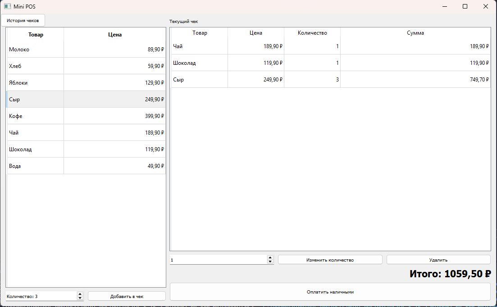
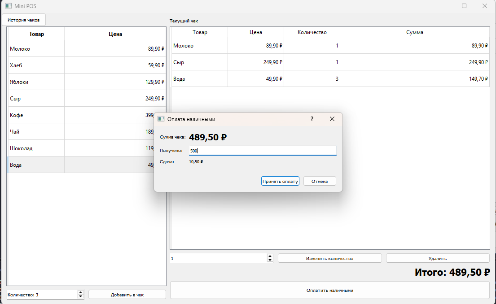
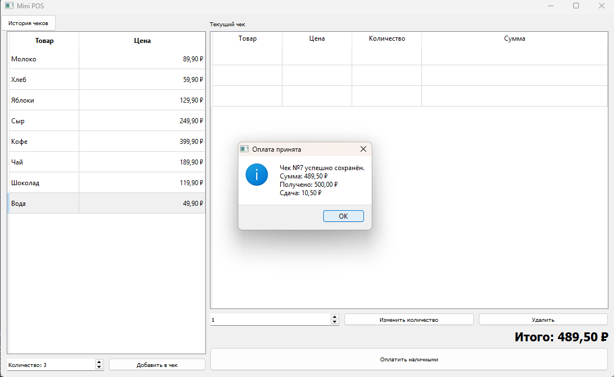
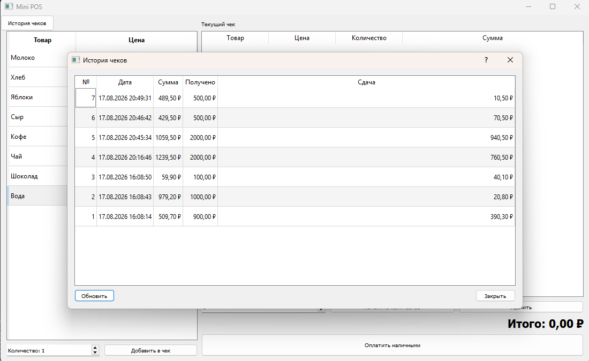

# Mini POS

Учебное desktop-приложение кассы на C++17 и Qt 5 Widgets. Позволяет собрать чек, принять оплату наличными, рассчитать сдачу и сохранить продажу в SQLite.

## Возможности

- каталог товаров и текущий чек;
- добавление, удаление и изменение количества товаров;
- расчёт итоговой суммы и сдачи;
- сохранение чеков в SQLite;
- история и просмотр состава чеков;
- поиск по дате и сумме;

## Скриншоты

| Главное окно, сохранение чека | Оплата и история |
| --- | --- |
|  |                |
|  |  |


## Стек

C++17, Qt 5.15 Widgets, Qt SQL, SQLite, CMake, Ninja, Boost.Test и MinGW 8.1 из комплекта Qt.

## Архитектура


- `domain` — `Product`, `CartItem`, `Sale`, `Receipt`; не зависит от Qt;
- `application` — оплата, оформление продажи и интерфейсы репозиториев;
- `infrastructure` — хранение чеков через Qt SQL и SQLite;
- `ui` — окна, диалоги и модели таблиц.

Деньги хранятся целым количеством копеек. Чек содержит снимок названия и цены товара на момент продажи.

## Сборка на Windows

Необходимы Qt 5.15.2 с `MinGW 8.1 64-bit`, CMake, Ninja и Boost.

```powershell
mkdir build
cd build
cmake build ..
```

В VS Code: `CMake: Configure` → `CMake: Build` → запуск target `mini_pos`.

## Тесты

```powershell
ctest --test-dir build --output-on-failure
```

Тесты проверяют продажу, оплату, сохранение и чтение чеков.

## База данных

SQLite-файл создаётся в `QStandardPaths::AppLocalDataLocation`.
